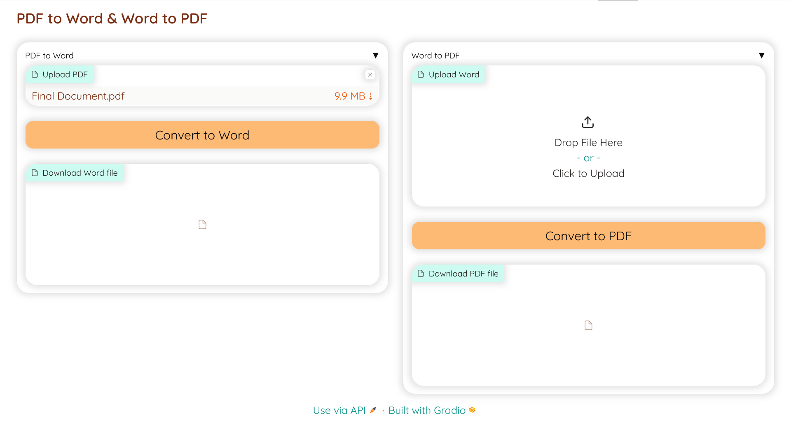
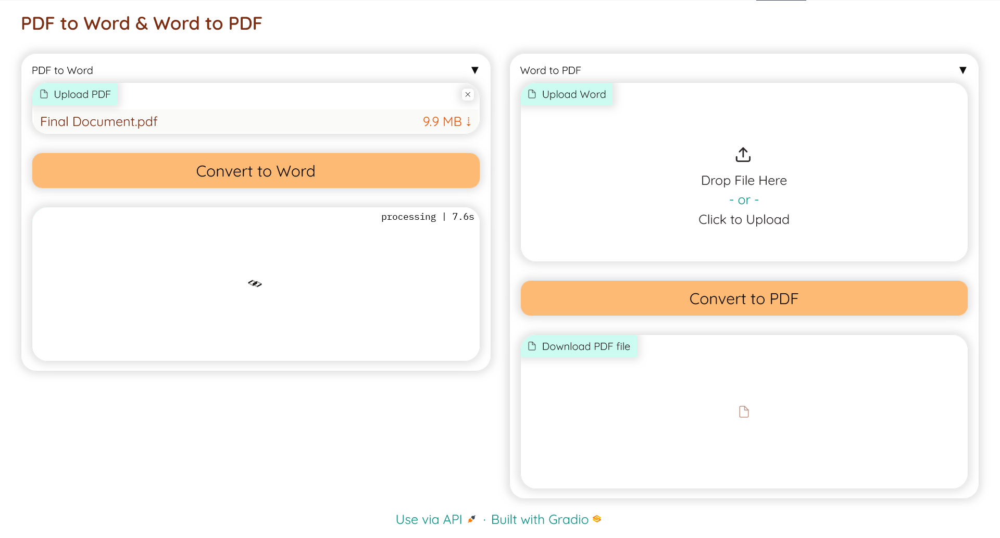
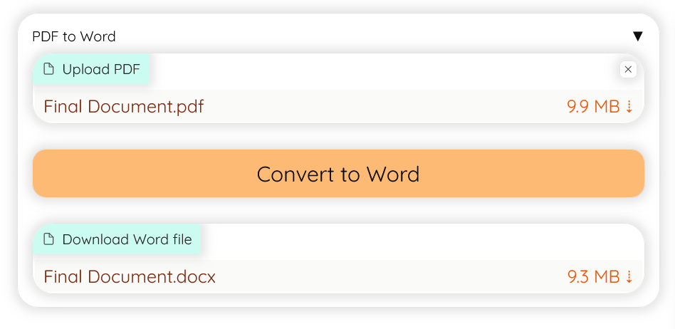

🚀Check out the configuration reference at https://huggingface.co/docs/hub/spaces-config-reference

🚀Huggingface Spaces : https://huggingface.co/spaces/prithivMLmods/Pdf-to-Word

🚀Docs for Space : 

    # Make sure you have git-lfs installed (https://git-lfs.com)
    git lfs install
    
    git clone https://huggingface.co/spaces/prithivMLmods/Pdf-to-Word
    
    # If you want to clone without large files - just their pointers
    
    GIT_LFS_SKIP_SMUDGE=1 git clone https://huggingface.co/spaces/prithivMLmods/Pdf-to-Word

## ⤵️Upload the file for Conversion

## 📂The Conversion Process starts

## 🔽The Final Converted file to Download

## Requirements.txt
  gradio
  
  python-docx
  
  pdf2docx
  
  fpdf2

.

.

.
